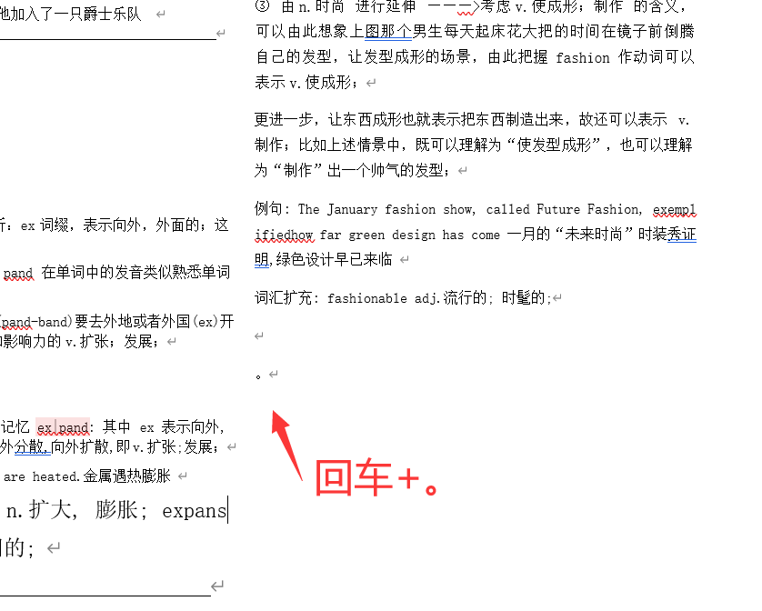

# anki-doc-to-excel

## 简介
一个方便将单词书word文档转换为excel的python程序，主要适用于王振宇的4500词系列

## 配置

* python版本3.12.2
* python-docx库1.1.0
* pandas库 2.1.4

## 使用流程

1. 夸克扫描单词书，拍照并转换为word文档
2. 然后将扫描的所有word文档合并为一个word文档
* 在word中将所有的'。'替换为空格
* 检查所有单词组中的单词部分是否只有字母，无空格等特殊符号
* 在word文档的最后一行使用回车+中文句号'。'
如图

3. 将这个word的路径放入`docx_to_excel(a.doc,b.xlsx)`中的a处，b则为创建的文件名
4. 将创建的.xlsx文件使用`excel_to_txt()`将excel转换为txt文件
5. 将创建的txt文件导入anki中即可
6. 如果出现运行失败的问题，可以使用`check_question(docx_file)`,`check_question_2(docx_file)`来排查问题并修改 